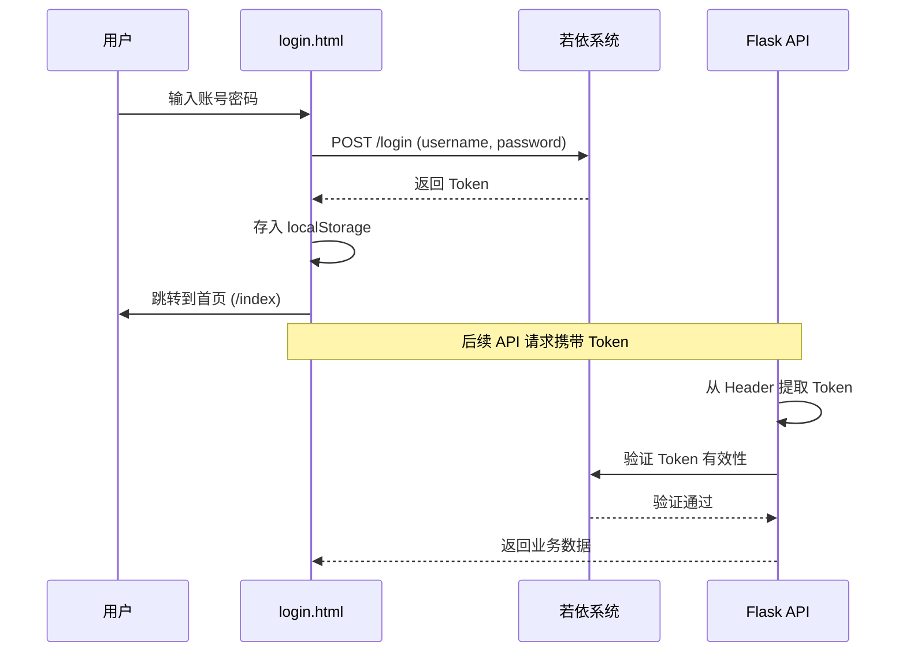
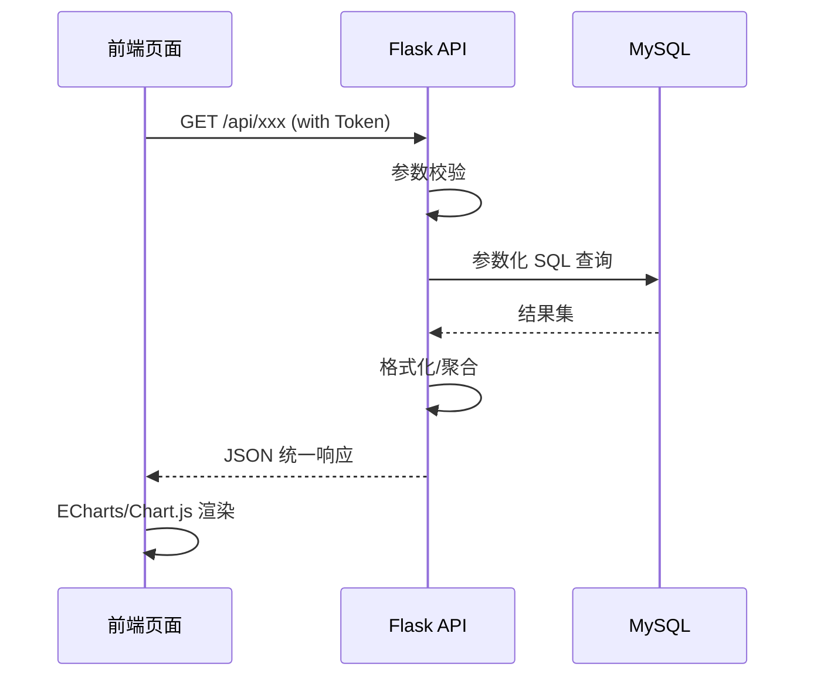

# 系统架构

> 镇江烟草人才培养数智平台的系统架构概览。

---

## 一、总体架构

```mermaid
graph TB
    subgraph "用户层"
        B[浏览器 / PC端]
    end

    subgraph "前端层"
        HTML[静态HTML页面]
        TAIL[Tailwind CSS]
        ECH[ECharts / Chart.js]
        FA[FontAwesome 图标]
    end

    subgraph "网关层"
        NGINX[Nginx 反向代理<br/>(未来引入)]
    end

    subgraph "后端层"
        FLASK[Flask API Server<br/>zjyc_api.py → 模块化]
    end

    subgraph "外部认证"
        RUOYI[若依系统<br/>36.149.161.6:18114]
    end

    subgraph "数据层"
        DB1[(MySQL<br/>210.16.170.156:3306<br/>zj-yancao)]
        DB2[(MySQL<br/>36.149.161.6:33973<br/>yancao)]
        FILES[静态资源<br/>210.16.170.156:58000]
    end

    B --> HTML
    HTML --> FLASK
    HTML --> RUOYI
    FLASK --> DB1
    FLASK --> DB2
    HTML --> FILES
```

## 二、当前部署拓扑

```
┌──────────────────────────────────────────────────────┐
│                   公网 / 内网                          │
├──────────────────────────────────────────────────────┤
│                                                        │
│  ┌──────────────┐    ┌─────────────────────────────┐   │
│  │  服务器 A     │    │  服务器 B                    │   │
│  │  210.16.170.156│   │  36.149.161.6               │   │
│  │              │    │                             │   │
│  │  MySQL:3306  │    │  MySQL:33973                │   │
│  │  DB: zj-yancao│   │  DB: yancao                 │   │
│  │              │    │                             │   │
│  │  静态资源:    │    │  若依系统:18114              │   │
│  │  :58000      │    │  (登录认证SSO)               │   │
│  └──────────────┘    └─────────────────────────────┘   │
│                                                        │
│  ┌─────────────────────────────────────────────────┐  │
│  │  开发/部署机 (Flask API Server)                  │  │
│  │  端口: 由启动参数指定 (默认 8000/58000)          │  │
│  └─────────────────────────────────────────────────┘  │
└──────────────────────────────────────────────────────┘
```

## 三、技术栈明细

| 组件 | 当前 | 重构后目标 |
|------|------|-----------|
| 后端框架 | Flask (单文件) | Flask + Blueprints |
| 数据库 | PyMySQL (裸连) | PyMySQL + 连接池 |
| 配置管理 | 硬编码字符串 | python-dotenv + .env |
| 前端 | 纯 HTML | 纯 HTML + 公共模块 |
| CSS | Tailwind CDN (各页独立) | Tailwind CDN + 统一主题变量 |
| 图表 | ECharts 5.4 + Chart.js 4.4 | 同上（统一引入） |
| 图标 | FontAwesome 4.7 / 7.1 | FontAwesome 6 统一版本 |
| 静态服务 | Python http.server | Flask 直接托管 |
| 部署 | 手动 python 启动 | gunicorn + systemd |
| 认证 | 若依 SSO (外部) | 若依 Token 校验中间件 |

## 四、数据流

### 4.1 登录认证流程



### 4.2 数据查询流程



## 五、相关文档

- [数据库设计](./database-schema)
- [API 接口参考](./api-reference)
- [前端架构](./frontend-architecture)
- [部署运维](./deployment)
