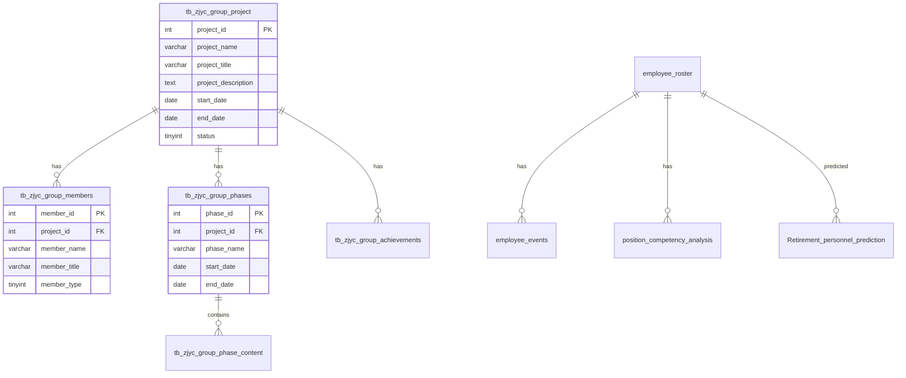

# 数据库设计

> 项目涉及的数据库表结构与说明。数据分布在两台 MySQL 服务器上。

---

## 一、数据库概览

| 数据库 | 服务器 | 用途 |
|--------|--------|------|
| `zj-yancao` | `210.16.170.156:3306` | 主业务数据库（人才、导师、项目等） |
| `yancao` | `36.149.161.6:33973` | 备用/历史数据库 |

---

## 二、主库 `zj-yancao` 表结构

### 2.1 课题项目组模块

#### `tb_zjyc_group_project` — 项目基本信息表

| 字段 | 类型 | 说明 |
|------|------|------|
| `project_id` | INT PK AUTO_INCREMENT | 项目 ID |
| `project_name` | VARCHAR(100) NOT NULL | 项目名称 |
| `project_title` | VARCHAR(200) NOT NULL | 项目标题 |
| `project_description` | TEXT NOT NULL | 项目简介 |
| `project_intro1` | TEXT | 项目介绍段落1 |
| `project_intro2` | TEXT | 项目介绍段落2 |
| `project_slogan` | VARCHAR(200) | 项目标语 |
| `background_image` | VARCHAR(500) | 背景图片 URL |
| `start_date` | DATE | 项目开始日期 |
| `end_date` | DATE | 项目结束日期 |
| `status` | TINYINT DEFAULT 1 | 状态：0-草稿，1-发布，2-归档 |
| `created_at` | DATETIME | 创建时间 |
| `updated_at` | DATETIME | 更新时间 |

> 索引: `idx_status`, `idx_created_at`, `idx_start_date`, `idx_end_date`

#### `tb_zjyc_group_members` — 团队成员表

| 字段 | 类型 | 说明 |
|------|------|------|
| `member_id` | INT PK AUTO_INCREMENT | 成员 ID |
| `project_id` | INT FK → tb_zjyc_group_project | 关联项目 ID |
| `member_name` | VARCHAR(50) NOT NULL | 成员名字 |
| `member_title` | VARCHAR(100) NOT NULL | 成员职位/角色 |
| `member_image` | VARCHAR(500) NOT NULL | 成员头像 URL |
| `member_type` | TINYINT DEFAULT 1 | 类型：0-项目负责人，1-团队成员 |
| `description` | VARCHAR(200) | 成员描述 |
| `sort_order` | INT DEFAULT 0 | 排序 |
| `created_at` | DATETIME | 创建时间 |
| `updated_at` | DATETIME | 更新时间 |

> 索引: `idx_project_id`, `idx_member_type`, `idx_sort_order`

#### `tb_zjyc_group_phases` — 项目实施阶段表

| 字段 | 类型 | 说明 |
|------|------|------|
| `phase_id` | INT PK AUTO_INCREMENT | 阶段 ID |
| `project_id` | INT FK | 关联项目 ID |
| `phase_name` | VARCHAR(100) NOT NULL | 阶段名称 |
| `phase_icon` | VARCHAR(50) NOT NULL | 图标 (FontAwesome class) |
| `start_date` | DATE NOT NULL | 开始日期 |
| `end_date` | DATE NOT NULL | 结束日期 |
| `phase_description` | TEXT | 阶段描述 |
| `sort_order` | INT DEFAULT 0 | 排序 |
| `created_at` | DATETIME | 创建时间 |
| `updated_at` | DATETIME | 更新时间 |

#### `tb_zjyc_group_phase_content` — 阶段内容表

| 字段 | 类型 | 说明 |
|------|------|------|
| `content_id` | INT PK AUTO_INCREMENT | 内容 ID |
| `phase_id` | INT FK | 关联阶段 ID |
| `project_id` | INT FK | 关联项目 ID |
| `content_title` | VARCHAR(100) | 内容标题 |
| `content_type` | TINYINT DEFAULT 0 | 类型：0-列表项，1-段落 |
| `content_text` | TEXT NOT NULL | 内容文本 |
| `sort_order` | INT DEFAULT 0 | 排序 |
| `created_at` | DATETIME | 创建时间 |
| `updated_at` | DATETIME | 更新时间 |

#### `tb_zjyc_group_achievements` — 项目成果表

| 字段 | 类型 | 说明 |
|------|------|------|
| `achievement_id` | INT PK AUTO_INCREMENT | 成果 ID |
| `project_id` | INT FK | 关联项目 ID |
| `achievement_name` | VARCHAR(200) NOT NULL | 成果名称 |
| `achievement_type` | VARCHAR(50) | 成果类型 |
| `achievement_desc` | TEXT | 成果描述 |
| `achievement_date` | DATE | 成果日期 |
| `sort_order` | INT DEFAULT 0 | 排序 |
| `created_at` | DATETIME | 创建时间 |
| `updated_at` | DATETIME | 更新时间 |

### 2.2 导师帮带模块

#### `tb_zjyc_teacher` — 导师关系表

| 字段 | 类型 | 说明 |
|------|------|------|
| `id` | INT PK | ID |
| `name` | VARCHAR(50) | 学员姓名 |
| `teacher` | VARCHAR(50) | 导师姓名 |
| `type` | VARCHAR(20) | 导师类型（政治导师/业务导师/朋辈导师） |
| `class` | VARCHAR(20) | 届数/毕业时间 |

### 2.3 人才库模块

#### `hs_rencai` — 人才信息表

> 字段由代码查询推断，具体字段名需从数据库确认

| 字段 | 类型（推测） | 说明 |
|------|-------------|------|
| `name` | VARCHAR(50) | 姓名 |
| `category` | VARCHAR(50) | 人才分类 |
| ... | | 其他字段待补充 |

### 2.4 员工相关表

#### `employee_roster` — 员工花名册

| 字段 | 类型 | 说明 |
|------|------|------|
| `id` | INT | 员工 ID |
| `name` | VARCHAR(50) | 姓名 |
| `department` | VARCHAR(100) | 部门 |
| `gender` | VARCHAR(10) | 性别 |
| `birth_date` | DATE | 出生日期 |
| `current_position` | VARCHAR(100) | 当前职位 |
| `education_degree` | VARCHAR(50) | 学历 |
| `current_position_years` | INT | 当前职位工作时间 |
| `major` | VARCHAR(100) | 专业 |
| `political_status` | VARCHAR(20) | 是否党员 |
| `professional_qualification` | VARCHAR(100) | 专业技术资格 |
| `vocational_skill_level` | VARCHAR(100) | 职业技能等级 |
| `work_start_date` | DATE | 参加工作时间 |
| `position_level` | INT | 职位层级 |

#### `red_alert` — 红色预警表

| 字段 | 类型 | 说明 |
|------|------|------|
| `department` | VARCHAR(100) | 部门 |
| `retiring_count` | INT | 退休人数 |
| `total_count` | INT | 总人数 |
| `retirement_ratio` | DECIMAL | 退休比例 |
| `is_red_alert` | TINYINT | 是否红色预警 |

#### `Retirement_personnel_prediction` — 退休人员预测表

| 字段 | 类型 | 说明 |
|------|------|------|
| `id` | INT | ID |
| `name` | VARCHAR(50) | 姓名 |
| `department` | VARCHAR(100) | 部门 |
| `gender` | VARCHAR(10) | 性别 |
| `birth_date` | DATE | 出生日期 |
| `retiring_count` | INT | 退休计数（>0 表示即将退休） |

#### `personnel_statistics` — 人员编制统计表

| 字段 | 类型 | 说明 |
|------|------|------|
| `id` | INT PK | ID |
| `unit` | VARCHAR(100) | 单位名称 |
| `department` | VARCHAR(100) | 部门名称 |
| `authorized_total` | INT | 编制数-总数 |
| `authorized_unit_leader` | INT | 编制数-单位领导 |
| `authorized_department_leader` | INT | 编制数-部门领导 |
| `authorized_secondary_dept_head` | INT | 编制数-二级部门负责人 |
| `authorized_section_level_non_leader` | INT | 编制数-科级非领导 |
| `authorized_clerk_level12` | INT | 编制数-一、二级科员 |
| `authorized_comprehensive_affairs` | INT | 编制数-综合事务类 |
| `authorized_business_operation` | INT | 编制数-业务及生产操作类 |
| `actual_total` | INT | 实有数-总数 |
| `actual_*` | INT | 对应实有字段 |
| `remark` | TEXT | 备注 |

#### `position_competency_analysis` — 岗位胜任力分析表

| 字段 | 类型 | 说明 |
|------|------|------|
| `id` | INT PK | ID |
| `name` | VARCHAR(50) | 员工姓名 |
| (多个评分维度字段) | | 各维度胜任力评分 |

#### `employee_events` — 员工事件表

| 字段 | 类型 | 说明 |
|------|------|------|
| `id` | INT PK | ID |
| `name` | VARCHAR(50) | 员工姓名 |
| `event_date` | DATE | 事件日期 |
| `event_type` | VARCHAR(50) | 事件类型 |
| `event_detail` | TEXT | 事件详情 |

---

## 三、实体关系图

---

## 四、相关文档

- [[api-reference|API 接口参考]]
- [[modules-overview|模块总览]]
