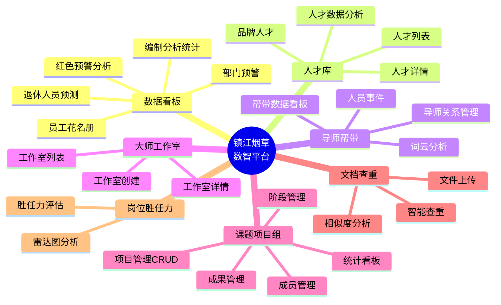

# 模块总览

> 项目功能模块清单与说明。

---

## 一、模块全景

## 二、模块详细说明

### 2.1 数据看板 (Dashboard)

| 属性 | 说明 |
|------|------|
| **页面** | `index.html`, `board.html`, `Recruitment_forecast.html` |
| **API 前缀** | `/red_alert`, `/retirement_personnel_prediction`, `/compilation` 等 |
| **主要功能** | 红色预警分析、退休人员预测、人员编制统计、部门预警分析、员工花名册 |
| **图表类型** | ECharts 柱状图/饼图/折线图 |
| **数据源** | DB1: zj-yancao 库的 `red_alert`, `Retirement_personnel_prediction`, `personnel_statistics`, `employee_roster` 表 |

### 2.2 人才库 (Talent Pool)

| 属性 | 说明 |
|------|------|
| **页面** | `人才库/talent_bank.html`, `人才库/talent_brand.html`, `人才库/talent-detail.html`, `人才库/talent_analysis_dashboard.html` |
| **API 前缀** | `/api/zjyc/score`, `/api/zjyc/count_by_category`, `/api/board/talent/category` |
| **主要功能** | 人才信息展示、品牌人才管理、人才详情查看、人才数据统计分析 |
| **数据源** | DB1 的 `hs_rencai`, `employee_roster` 等表 |

### 2.3 导师帮带 (Mentor)

| 属性 | 说明 |
|------|------|
| **页面** | `导师帮带看板/teacher.html`, `导师帮带看板/pia.html` |
| **API 前缀** | `/api/zjyc/teacher`, `/employee/events`, `/person/wordcloud` |
| **主要功能** | 导师关系展示、帮带数据统计、员工事件追踪、词云分析 |
| **数据源** | DB1 的 `tb_zjyc_teacher`, `employee_events` 等表 |

### 2.4 大师工作室 (Master Studio)

| 属性 | 说明 |
|------|------|
| **页面** | `大师工作室/master_class.html`, `大师工作室/studio-detail.html` |
| **API 前缀** | `/api/zjyc/create_master_studio` |
| **主要功能** | 工作室列表展示、工作室详情、创建工作室 |
| **数据源** | DB1 的 `master_studio` 等表 |

### 2.5 课题项目组 (Project Group)

| 属性 | 说明 |
|------|------|
| **页面** | `课题项目组/admin-projects.html`, `课题项目组/project-group.html`, `课题项目组/project-group-edit.html`, `课题项目组/group_list.html` |
| **API 前缀** | `/api/group/*` |
| **主要功能** | 项目 CRUD、成员管理、阶段管理、成果管理、项目展示、统计看板 |
| **数据源** | DB1 的 `tb_zjyc_group_project`, `tb_zjyc_group_members`, `tb_zjyc_group_phases`, `tb_zjyc_group_phase_content`, `tb_zjyc_group_achievements` 等表 |

### 2.6 岗位胜任力 (Position Competency)

| 属性 | 说明 |
|------|------|
| **页面** | `position_competency_analysis.html` |
| **API 前缀** | `/position_competency_analysis` |
| **主要功能** | 员工岗位胜任力评估、雷达图展示 |
| **数据源** | DB1 的 `position_competency_analysis` 表 |

### 2.7 文档查重 (Document Check)

| 属性 | 说明 |
|------|------|
| **页面** | `ddc.html`, `ddc_v2.html` |
| **API** | 纯前端实现（浏览器端 mammoth.js + pdf.js 解析文档） |
| **主要功能** | 上传 docx/pdf，浏览器端解析并做文本相似度比对 |
| **数据源** | 无后端依赖（纯浏览器端处理） |

## 三、辅助脚本清单

| 脚本 | 用途 |
|------|------|
| `txt2db_importer.py` | 固定格式 TXT 文件导入 MySQL |
| `update_talent_demand.py` | Excel 人才需求数据导入 |
| `update_party_join_date.py` | 员工入党日期批量更新 |
| `employee_roster_format.py` | 员工花名册格式化处理 |
| `ps_restart.py` | 进程重启脚本 |
| `report_gen.py` | Word 报告自动生成（基于模板替换）|
| `doc_to_docx.py` | 文档格式转换 |
| `svg_to_png.py` | SVG 转 PNG |
| `extract_excel_formulas.py` | Excel 公式提取 |
| `test_toggle_visibility.py` | 项目显示/隐藏功能测试 |
