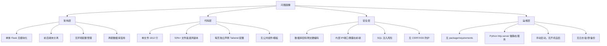

# 重构方案

> 本方案面向"镇江烟草人才培养数智平台"整体重构，采用**渐进式四阶段**策略，兼顾业务连续性和技术债务清理。

---

## 一、项目现状分析

### 1.1 代码规模

| 维度 | 数值 |
|------|------|
| 页面文件 | ~40+ 个 HTML（含大量备份/副本） |
| 后端 API 文件 | 1 个（zjyc_api.py, 1812 行, 24 路由） |
| 辅助 Python 脚本 | ~10 个（数据导入、格式转换、测试等） |
| 静态资源 | FontAwesome 7.1, ECharts 5.4, AOS 2.3, Tailwind CDN |
| 数据库 | MySQL × 2 服务器（210.16.170.156:3306 + 36.149.161.6:33973） |
| 总代码行 | ~21,600 行 |

### 1.2 核心问题画像



### 1.3 文件清理清单

需要保留的有效文件（其余为废弃副本可删除）：

**保留**：
- `zjyc_api.py` — 后端 API（重构目标）
- `HR_Echart_API.py` — 早期 API（若不兼容则合并到 zjyc_api）
- `http.server.py` — 静态文件服务（可废弃，用 Flask 替代）
- `login.html` — 登录页
- `index.html` / `board.html` — 数据看板
- `model.html` — 招聘分析模型页面
- `人才库/talent_bank.html` — 人才库主页面
- `人才库/talent_brand.html` — 品牌人才
- `人才库/talent-detail.html` — 人才详情
- `人才库/talent_analysis_dashboard.html` — 人才数据分析
- `大师工作室/master_class.html` — 大师工作室列表
- `大师工作室/studio-detail.html` — 工作室详情
- `导师帮带看板/teacher.html` — 导师帮带看板
- `课题项目组/admin-projects.html` — 项目管理
- `课题项目组/project-group.html` — 项目组展示
- `课题项目组/project-group-edit.html` — 项目编辑
- `课题项目组/group_list.html` — 项目组列表
- `login.vue` — 若依 Vue 登录组件（集成参考）
- `position_competency_analysis.html` — 胜任力分析
- `ddc.html` / `ddc_v2.html` — 文档查重
- `Recruitment_forecast.html` — 招聘预测
- `txt2db_importer.py` / `ps_restart.py` / `update_*.py` / `report_gen.py` — 运维脚本

---

## 二、重构路线图（四阶段）

### Phase 1: 基础设施与清理（预计 2-3 天）

**目标**: 建立项目骨架、清理废弃文件、引入项目管理

#### 1.1 目录结构重组

```
ZY-HR/
├── .env.example          # 环境变量模板
├── .gitignore
├── requirements.txt      # Python 依赖
├── README.md             # 项目说明
├── docs/                 # 文档
│   └── wiki/             # 项目 wiki
├── backend/              # 后端（新建）
│   ├── __init__.py
│   ├── app.py            # Flask 入口
│   ├── config.py         # 配置管理（从环境变量读取）
│   ├── models/           # 数据模型
│   │   ├── __init__.py
│   │   └── db.py         # 数据库连接池
│   ├── routes/           # 路由模块（Blueprint）
│   │   ├── __init__.py
│   │   ├── dashboard.py  # 看板相关 API
│   │   ├── talent.py     # 人才库 API
│   │   ├── teacher.py    # 导师帮带 API
│   │   ├── studio.py     # 大师工作室 API
│   │   ├── project.py    # 课题项目组 API
│   │   └── ddc.py        # 文档查重 API
│   ├── services/         # 业务逻辑层
│   │   ├── __init__.py
│   │   ├── talent_service.py
│   │   └── project_service.py
│   └── utils/            # 工具函数
│       ├── __init__.py
│       └── helpers.py
├── static/               # 静态资源（统一管理）
│   ├── css/
│   │   ├── main.css      # 主题变量 + 全局样式
│   │   └── components.css # 组件样式
│   ├── js/
│   │   ├── api.js        # API 请求封装
│   │   └── utils.js      # 工具函数
│   └── lib/              # 第三方库（本地化，可选）
├── scripts/              # 运维脚本
│   ├── clean_old_files.py # 废弃文件清理
│   └── import_data.py    # 数据导入
├── pages/                # 前端页面（保持现状，逐步迁移）
│   ├── index.html
│   ├── login.html
│   ├── dashboard/
│   ├── talent/
│   ├── teacher/
│   ├── studio/
│   ├── project/
│   └── ddc/
└── yancao/               # 外部引用的静态资源
```

#### 1.2 具体任务

1. **创建 `requirements.txt`**
   ```txt
   Flask==3.1.*
   flask-cors==5.*
   PyMySQL==1.1.*
   python-dotenv==1.1.*
   python-multipart==0.0.*
   gunicorn==23.*
   ```

2. **创建 `.env.example`** — 数据库配置、接口地址模板
   ```env
   DB_HOST=your_host
   DB_PORT=3306
   DB_USER=your_user
   DB_PASSWORD=your_password
   DB_NAME=zj-yancao
   
   DB2_HOST=your_host
   DB2_PORT=33973
   DB2_USER=root
   DB2_PASSWORD=your_password
   DB2_NAME=yancao
   
   SECRET_KEY=your-secret-key
   RUOYI_BASE_URL=http://36.149.161.6:18114
   ```

3. **创建 `backend/config.py`** — 从环境变量读取配置，替代硬编码

4. **创建 `backend/models/db.py`** — 统一数据库连接管理，连接池

5. **创建 `.gitignore`** — 排除 `.env`、`__pycache__`、`*.bak` 等

6. **清理废弃文件** — 删除所有 `*- 副本*`、`*.bak`、`*copy*`、旧版本文件

7. **将当前 `zjyc_api.py` 复制为 `zjyc_api_legacy.py`** 备案，然后开始重构 ✅

#### 1.3 交付物

- [x] 标准化项目目录结构
- [x] `requirements.txt` + `.env` 配置管理
- [x] `.gitignore` + `README.md`
- [ ] 废弃文件清理脚本（`scripts/clean_old_files.py`）
- [x] 基础后端骨架（app.py + config.py + db.py）

---

### Phase 2: 后端重构（预计 5-7 天）

**目标**: 将单文件 API 拆分为模块化 Flask 应用

#### 2.1 Blueprint 路由拆分

| 当前路由 | 目标模块 | 优先级 |
|---------|---------|--------|
| `/red_alert`, `/retirement_personnel_prediction`, `/compilation`, `/red_alert_department`, `/employee_roster_markdown` | `routes/dashboard.py` + `routes/report.py` | 🔶 ✅ 已迁移 |
| `/position_competency_analysis`, `/api/zjyc/score`, `/api/zjyc/count_by_category`, `/api/board/talent/category` | `routes/dashboard.py` | 🔶 ✅ 已迁移(position_competency_analysis) |
| `/employee/events`, `/person/wordcloud`, `/api/zjyc/teacher` | `routes/teacher.py` | 🔶 高 |
| `/api/zjyc/create_master_studio` | `routes/studio.py` | 🔶 高 |
| `/api/group/projects`, `/api/group/<id>`, `/api/group/<id>/members`, `/api/group/<id>/phases`, `/api/group/<id>/achievements`, `/api/group/<id>/dashboard`, `/api/group/create-project`, `/api/group/<id>/add-member`, `/api/group/<id>/add-achievement`, `/api/group/statistics`, `/api/group/<id>/toggle-visibility` | `routes/project.py` | 🔶 高 |
| `/red_alert`, `/retirement_personnel_prediction` (from HR_Echart_API.py 的旧连接) | `routes/dashboard.py` | 🔵 中 |

#### 2.2 配置管理增强

```python
# backend/config.py
from dataclasses import dataclass, field
from os import environ
from dotenv import load_dotenv

load_dotenv()

@dataclass
class DBConfig:
    host: str = field(default_factory=lambda: environ['DB_HOST'])
    port: int = field(default_factory=lambda: int(environ.get('DB_PORT', '3306')))
    user: str = field(default_factory=lambda: environ['DB_USER'])
    password: str = field(default_factory=lambda: environ['DB_PASSWORD'])
    database: str = field(default_factory=lambda: environ['DB_NAME'])
    charset: str = 'utf8mb4'
    connect_timeout: int = 10

@dataclass
class AppConfig:
    db: DBConfig = field(default_factory=DBConfig)
    db2: DBConfig = field(default_factory=lambda: DBConfig(
        host=environ.get('DB2_HOST', environ['DB_HOST']),
        port=int(environ.get('DB2_PORT', '33973')),
        user=environ.get('DB2_USER', 'root'),
        password=environ.get('DB2_PASSWORD', ''),
        database=environ.get('DB2_NAME', environ['DB_NAME'])
    ))
    secret_key: str = field(default_factory=lambda: environ.get('SECRET_KEY', 'dev-key'))
    debug: bool = field(default_factory=lambda: environ.get('FLASK_DEBUG', '0') == '1')
    ruoyi_base_url: str = field(default_factory=lambda: environ.get('RUOYI_BASE_URL', ''))

config = AppConfig()
```

#### 2.3 数据库连接管理

使用连接池和上下文管理器，避免每个请求重复开闭连接：

```python
# backend/models/db.py
from contextlib import contextmanager
import pymysql
from pymysql.cursors import DictCursor
from backend.config import config

class DatabaseManager:
    def __init__(self, db_config, pool_size=5):
        self.config = db_config
        self._pool = []

    @contextmanager
    def get_conn(self):
        conn = pymysql.connect(**self.config.__dict__, cursorclass=DictCursor)
        try:
            yield conn
            conn.commit()
        except Exception:
            conn.rollback()
            raise
        finally:
            conn.close()

db = DatabaseManager(config.db)
db2 = DatabaseManager(config.db2)
```

#### 2.4 API 响应统一格式

```python
# backend/utils/helpers.py
from flask import jsonify

def success(data=None, msg='ok'):
    return jsonify({'code': 200, 'msg': msg, 'data': data})

def error(msg='error', code=500):
    return jsonify({'code': code, 'msg': msg, 'data': None}), code
```

#### 2.5 具体代码迁移示例

**迁移前**（zjyc_api.py 原样）:
```python
@app.route('/red_alert', methods=['GET'])
def get_red_alert():
    conn = get_db_connection()
    if not conn:
        return jsonify({'error': '无法连接到数据库'}), 500
    try:
        cursor = conn.cursor(pymysql.cursors.DictCursor)
        cursor.execute("SELECT * FROM red_alert")
        data = cursor.fetchall()
        return jsonify(data)
    except pymysql.MySQLError as e:
        return jsonify({'error': f'查询失败: {str(e)}'}), 500
    finally:
        if conn:
            conn.close()
```

**迁移后**（routes/dashboard.py）:
```python
from flask import Blueprint
from backend.models.db import db
from backend.utils.helpers import success, error

dashboard_bp = Blueprint('dashboard', __name__, url_prefix='/api')

@dashboard_bp.route('/red_alert')
def get_red_alert():
    with db.get_conn() as conn:
        with conn.cursor() as cursor:
            cursor.execute("SELECT * FROM red_alert")
            data = cursor.fetchall()
    return success(data)
```

#### 2.6 交付物

- [ ] `app.py` — 主入口，注册所有 Blueprint
- [ ] `config.py` — 环境变量配置管理
- [ ] `models/db.py` — 数据库连接池
- [ ] `routes/dashboard.py` — 看板/数据统计 API
- [ ] `routes/talent.py` — 人才库 API
- [ ] `routes/teacher.py` — 导师帮带 API
- [ ] `routes/studio.py` — 大师工作室 API
- [ ] `routes/project.py` — 课题项目组 API
- [ ] `routes/ddc.py` — 文档查重 API
- [ ] `utils/helpers.py` — 统一响应、工具函数
- [ ] 所有路由迁移完成，原 `zjyc_api.py` 仅保留为 legacy 备份
- [ ] API 兼容性测试通过

---

### Phase 3: 前端重构（预计 5-7 天）

**目标**: 统一前端设计体系、消除重复代码、提升可维护性

#### 3.1 方案选型

| 方案 | 说明 | 推荐度 |
|------|------|--------|
| **A: 保留纯 HTML + 引入公共模板** | 用 JS 模板引擎或服务端 include 实现组件复用，保留现有页面渐进改造 | ⭐⭐⭐ 推荐（风险最低，与现有页面兼容） |
| **B: 迁移到 Vue3** | login.vue 已在使用 Vue，前端全量迁移，组件化开发 | ⭐⭐ 较好但工作量大 |
| **C: 引入 Vite + 模块化** | 保留 HTML 但用 Vite 管理资源、变量、构建 | ⭐⭐⭐ 折中方案 |

**建议方案**: 采用 **方案 A + C 混合** — 先引入统一的 CSS 变量体系和公共 JS 模块，后续根据时间决定是否迁移到 Vue3。

#### 3.2 统一设计体系

```css
/* static/css/main.css — 统一主题变量 */
:root {
  /* 主色调 — 烟草绿 */
  --color-primary: #1E5A32;
  --color-primary-light: #2D8A4E;
  --color-primary-dark: #0F3A1E;

  /* 辅助色 */
  --color-secondary: #0A84FF;
  --color-accent: #D4AF37;

  /* 中性色 */
  --color-bg: #F5F7FA;
  --color-surface: #FFFFFF;
  --color-text: #1D2129;
  --color-text-secondary: #667085;

  /* 语义色 */
  --color-success: #52C41A;
  --color-warning: #FAAD14;
  --color-danger: #FF4D4F;
  --color-info: #165DFF;

  /* 布局 */
  --sidebar-width: 240px;
  --header-height: 64px;
  --border-radius: 8px;
  --shadow-sm: 0 2px 8px rgba(0,0,0,0.08);
  --shadow-md: 0 4px 20px rgba(0,0,0,0.1);

  /* 字体 */
  --font-sans: 'Inter', 'Microsoft YaHei', system-ui, sans-serif;
}
```

#### 3.3 公共 API 请求封装

```javascript
// static/js/api.js
const API_BASE = window.__API_BASE__ || '';

async function apiRequest(method, path, data = null) {
  const url = `${API_BASE}${path}`;
  const options = {
    method,
    headers: { 'Content-Type': 'application/json' },
  };
  if (data && method !== 'GET') {
    options.body = JSON.stringify(data);
  }
  // 自动携带 Token（从外部登录系统获取）
  const token = localStorage.getItem('Admin-Token');
  if (token) {
    options.headers['Authorization'] = `Bearer ${token}`;
  }
  const resp = await fetch(url, options);
  if (!resp.ok) throw new Error(`HTTP ${resp.status}`);
  return resp.json();
}

const api = {
  get: (path) => apiRequest('GET', path),
  post: (path, data) => apiRequest('POST', path, data),
  put: (path, data) => apiRequest('PUT', path, data),
  delete: (path) => apiRequest('DELETE', path),
};
```

#### 3.4 页面重构计划

按模块逐步改造，每完成一个模块的 UI 统一：

| 模块 | 页面 | 优先度 | 改造内容 |
|------|------|--------|---------|
| 布局 | 所有页面 | P0 | 引入统一 header/sidebar 布局组件 |
| 登录 | login.html | P1 | 保持现有设计，抽取公共样式 |
| 看板 | index.html, board.html | P1 | 统一主题色、图表配色 |
| 人才库 | talent_bank.html | P1 | 卡片样式统一、搜索/筛选组件化 |
| 课题项目 | admin-projects.html | P1 | 表单组件统一、列表组件复用 |
| 导师帮带 | teacher.html | P2 | 图表主题统一 |
| 大师工作室 | master_class.html | P2 | 卡片样式统一 |
| 文档查重 | ddc.html | P3 | 后续再处理 |

#### 3.5 CDN 依赖统一管理

将散落在各页面的 CDN 引用集中到一套：

```html
<!-- 统一引入（放在 header 模板块） -->
<link href="https://cdn.tailwindcss.com" rel="stylesheet">
<link href="https://cdnjs.cloudflare.com/ajax/libs/font-awesome/6.4.0/css/all.min.css" rel="stylesheet">
<script src="https://cdn.jsdelivr.net/npm/echarts@5.4.3/dist/echarts.min.js"></script>
<script src="https://cdn.jsdelivr.net/npm/chart.js@4.4.8/dist/chart.umd.min.js"></script>

<!-- 公共样式 -->
<link href="/static/css/main.css" rel="stylesheet">

<!-- 公共 JS -->
<script src="/static/js/api.js"></script>
<script src="/static/js/utils.js"></script>
```

#### 3.6 交付物

- [ ] `static/css/main.css` — 统一主题变量
- [ ] `static/css/components.css` — 公共组件样式（卡片、表格、表单、按钮）
- [ ] `static/js/api.js` — API 请求封装
- [ ] `static/js/utils.js` — 通用工具函数（日期格式、文本处理等）
- [ ] 布局组件化（统一 header + sidebar）
- [ ] P0/P1 模块的 UI 统一改造
- [ ] CDN 依赖统一

---

### Phase 4: 安全加固与运维（预计 3-5 天）

**目标**: 解决安全隐患、建立运维规范

#### 4.1 安全加固

| 项目 | 措施 | 优先级 |
|------|------|--------|
| 数据库密码 | 从代码删除，迁移到 `.env` + `config.py` | 🔴 紧急 |
| SQL 注入 | 所有查询改为参数化查询（已使用 %s 的基本合规，审计所有 LIKE 和 IN 子句） | 🔴 紧急 |
| 内部 IP 暴露 | 前端代码中的硬编码 IP 改为相对路径或 API_BASE 变量 | 🔴 紧急 |
| CORS 配置 | 从 `*` 改为白名单 | 🟡 重要 |
| 请求校验 | 添加输入校验中间件（类型、长度、边界） | 🟡 重要 |
| 认证集成 | 集成若依 Token 校验中间件，保护所有 API | 🟡 重要 |
| 静态资源 | 添加 MIME 类型校验 | 🟢 建议 |

#### 4.2 SQL 审计示例

```python
# 审计出的风险模式
# 风险模式1: LIKE 拼接
cursor.execute(f"SELECT * FROM table WHERE name LIKE '%{keyword}%'")
# ✅ 修复:
cursor.execute("SELECT * FROM table WHERE name LIKE %s", (f'%{keyword}%',))

# 风险模式2: IN 子句
ids = [1, 2, 3]
cursor.execute(f"SELECT * FROM table WHERE id IN ({','.join(map(str, ids))})")
# ✅ 修复:
placeholders = ','.join(['%s'] * len(ids))
cursor.execute(f"SELECT * FROM table WHERE id IN ({placeholders})", ids)
```

#### 4.3 运维体系

```ini
# Procfile (使用 gunicorn 部署)
web: gunicorn -w 4 -b 0.0.0.0:58000 backend.app:app
```

**启动脚本** `scripts/start.sh`:
```bash
#!/bin/bash
source venv/bin/activate
cd "$(dirname "$0")/.."
gunicorn -w 4 -b 0.0.0.0:58000 backend.app:app
```

**systemd 服务** `/etc/systemd/system/zj-hr.service`:
```ini
[Unit]
Description=ZY-HR Talent Platform Backend
After=network.target

[Service]
Type=simple
User=www-data
WorkingDirectory=/opt/ZY-HR
EnvironmentFile=/opt/ZY-HR/.env
ExecStart=/opt/ZY-HR/venv/bin/gunicorn -w 4 -b 0.0.0.0:58000 backend.app:app
Restart=always
RestartSec=10

[Install]
WantedBy=multi-user.target
```

#### 4.4 交付物

- [ ] 所有敏感配置从代码中移除
- [ ] SQL 注入审计完成
- [ ] API 请求校验中间件
- [ ] 若依 Token 验证集成
- [ ] gunicorn + systemd 部署配置
- [ ] 日志配置（按日滚动）
- [ ] 健康检查端点 `/api/health`

---

## 三、风险与注意事项

### 3.1 业务连续风险
- **重构期间保持原 `zjyc_api.py` 运行**，新后端并行部署，逐步切换路由
- Nginx 层做路由分发：新路由 → 新后端，旧路由 → 旧后端
- 每个路由迁移后做回归测试

### 3.2 数据库兼容性
- 两个数据库服务器的表结构和账号权限不同，重构时不能混用连接
- 表名在代码中以字符串形式出现（如 `hs_rencai`、`employee_roster`），不能改
- 分阶段迁移，每完成一个模块即测试

### 3.3 前端兼容性
- 现有页面大量使用内联 `onclick` 和全局函数，不能一次性改完
- 统一引入 api.js 后，新代码使用新封装，旧代码保留原调用方式
- 页面按模块逐个改造，每个模块改完即验证

### 3.4 依赖管理
- 当前使用 CDN 引入的库（Tailwind、ECharts、Chart.js、FontAwesome）在重构期间继续使用
- 统一引入文件后，逐步从各页面删除重复的 CDN 引用

---

## 四、时间估算

| Phase | 内容 | 工时 | 说明 |
|-------|------|------|------|
| Phase 1 | 基础设施与清理 | 2-3 天 | 可与其他任务并行 |
| Phase 2 | 后端重构 | 5-7 天 | 核心工作，逐路由迁移 |
| Phase 3 | 前端重构 | 5-7 天 | 可与 Phase 2 并行 |
| Phase 4 | 安全加固与运维 | 3-5 天 | 全周期贯穿 |
| **合计** | | **15-22 天** | 约 3-4 周 |

---

## 五、推荐执行策略

> **推荐策略**: 按 Phase1 → Phase2 → Phase4(安全) → Phase3 → Phase4(运维) 顺序执行

1. **第 1 周**: Phase 1（目录 + 配置 + 清理）+ Phase 2 开始（拆分路由）
2. **第 2 周**: Phase 2 完成 + Phase 4 安全加固
3. **第 3 周**: Phase 3 前端统一
4. **第 4 周**: Phase 4 运维 + 整体回归测试

**快速见效方案**（如果时间紧迫）:
- 优先做 Phase 1（基础） + Phase 4 安全（密码移除 + SQL 审计）
- 后端拆分可以边用边改
- 前端统一可以放到最后
